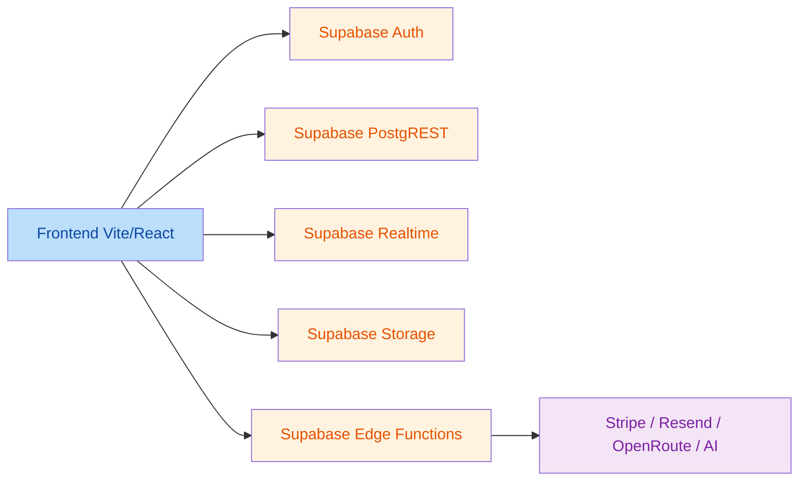
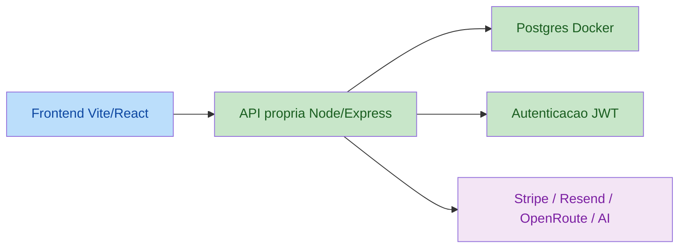

# Migracao Supabase -> Postgres + API propria

## Resumo

O projeto atual foi gerado no Lovable, mas hoje depende fortemente do ecossistema
do Supabase. Isso significa que trocar apenas a credencial do banco nao resolve,
porque o frontend conversa diretamente com:

- `Supabase Auth`
- `Supabase PostgREST`
- `Supabase Realtime`
- `Supabase Storage`
- `Supabase Edge Functions`

Nesta etapa foi criada a nova base para VPS propria com:

- `frontend` em container Docker
- `api` Node/Express com JWT
- `postgres` em container Docker

## Diagrama atual

## Diagrama alvo

## Dependencias atuais encontradas

- Auth do frontend em `src/hooks/useAuth.tsx`
- Cliente principal do Supabase em `src/integrations/supabase/client.ts`
- Realtime em `src/lib/realtime/RealtimeHub.ts`
- Storage em varios hooks e componentes, com buckets como `uploads`, `avatars`,
  `production-photos`, `marketplace`, `payment-proofs`, `billing-receipts`
- Edge functions consumidas em 24 chamadas via `supabase.functions.invoke(...)`
- Sentry tunelando por edge function em `src/main.tsx`
- Stripe com checkout/portal via edge functions

## Variaveis de ambiente atuais

### Frontend legado

- `VITE_SUPABASE_PROJECT_ID`
- `VITE_SUPABASE_PUBLISHABLE_KEY`
- `VITE_SUPABASE_URL`
- `VITE_PAYMENTS_CLIENT_TOKEN`
- `VITE_SENTRY_DSN`

### Funcoes Supabase / servicos externos

- `SUPABASE_URL`
- `SUPABASE_ANON_KEY`
- `SUPABASE_SERVICE_ROLE_KEY`
- `STRIPE_SANDBOX_API_KEY`
- `STRIPE_LIVE_API_KEY`
- `RESEND_API_KEY`
- `EMAIL_PROVIDER`
- `EMAIL_FROM`
- `OPENROUTE_API_KEY`
- `PAPPERS_API_KEY`
- `COMPANIES_HOUSE_API_KEY`
- `LOVABLE_API_KEY`

### Nova stack

- `DATABASE_URL`
- `JWT_SECRET`
- `JWT_EXPIRES_IN`
- `CORS_ORIGIN`
- `VITE_API_URL`

## O que ja foi criado nesta etapa

- `docker-compose.yml` com `frontend`, `api` e `postgres`
- `Dockerfile.frontend` para build e entrega do app React
- `backend/` com API inicial
- Auth inicial com JWT em:
  - `backend/src/routes/auth.ts`
  - `backend/src/middleware/auth.ts`
  - `backend/src/lib/jwt.ts`
- Modelo `users` em `backend/prisma/schema.prisma`
- Templates `.env.example` para root e backend

## Riscos e pendencias

- O frontend ainda faz acesso direto ao Supabase em mais de 100 arquivos.
- Somente subir os containers nao substitui a camada de dados do app.
- Ainda faltam endpoints REST para os modulos de negocio.
- Ainda faltam storage proprio e substituicao do realtime.
- As edge functions atuais precisam ser migradas para rotas da API propria ou workers separados.

## Ordem recomendada da migracao

1. Colocar a API propria em pe e validar `register/login/me`.
2. Migrar `AuthProvider` e `ProtectedRoute` para JWT proprio.
3. Introduzir um cliente HTTP interno e remover o cliente Supabase do frontend.
4. Migrar por dominio: usuarios, workspaces, permissoes, service orders, billing.
5. Substituir storage por S3/MinIO/local.
6. Substituir realtime por WebSocket/SSE ou polling controlado.
